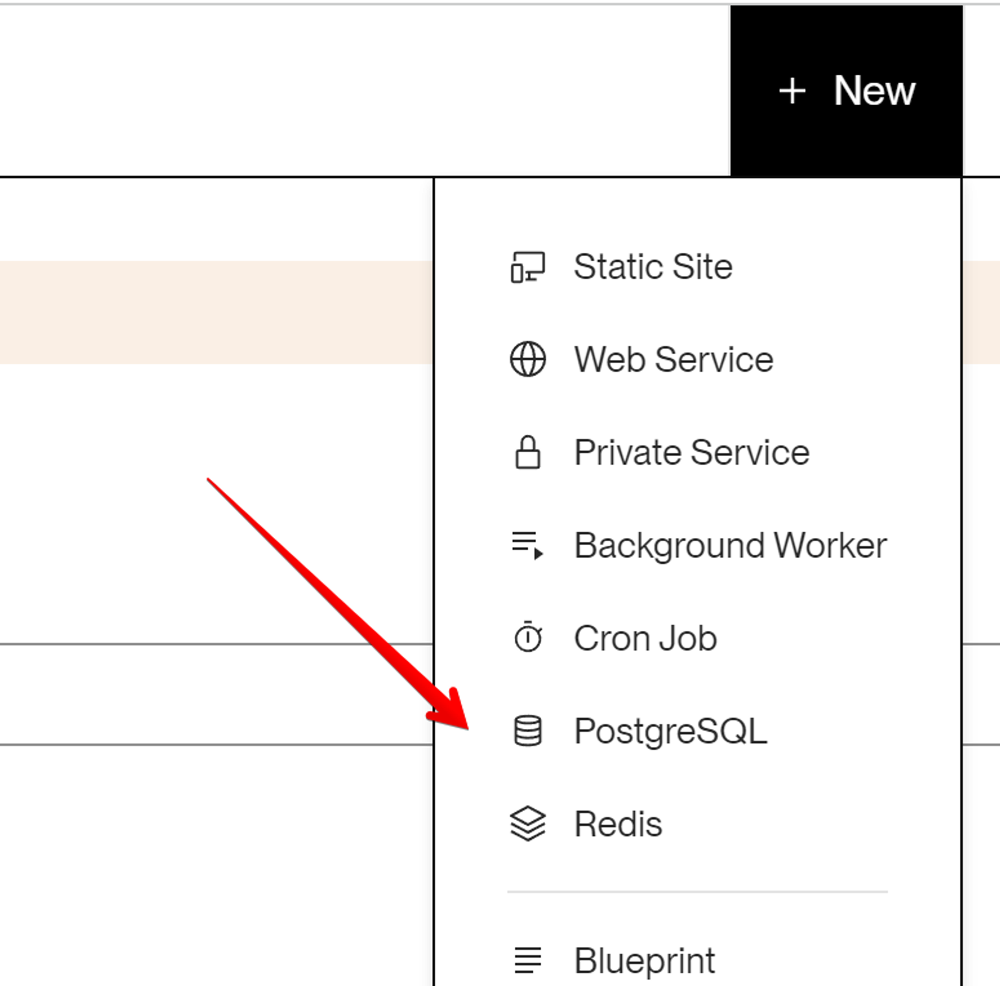
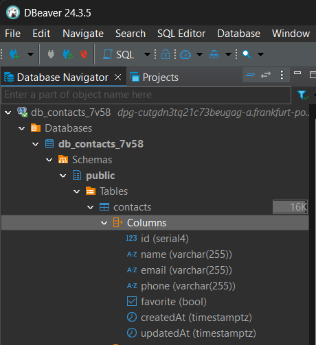

# Tier 4. Module 5 - Fullstack. Back End Development: Node.js

## Homework for Topic 6 - PostgresSQL and Sequelize

### Technical task

Create a branch `03-postgresql` from the `master` branch. Continue creating the REST API to work with the contact collection.

#### Step 1

Create an account on [Render](https://render.com/). Then create a new PostgresSQL database in the account, which should be called `db-contacts`:



#### Step 2

Install the [pgAdmin](https://www.pgadmin.org/download/) or [DBeaver](https://dbeaver.io/) graphical editor for convenient work with the PosgresSQL database. Connect to the created cloud database via the graphical editor and create the `contacts` table.



#### Step 3

Use the source code from **homework #2** and replace storing contacts from a json file with a database you created.

- Write code to create a connection to PosgresSQL using [Sequelize](https://www.npmjs.com/package/sequelize).
- If the connection is successful, print the message `"Database connection successful"` to the console.
- Be sure to handle the connection error. Print the error message to the console and end the process using `process.exit(1)`.
- In the query processing functions, replace the code for CRUD operations on contacts from a file with Sequelize methods for working with a collection of contacts in the database.

**Sequelize model `contacts`:**

```JS
const User = sequelize.define(
  'Contact', {
    name: {
      type: DataTypes.STRING,
      allowNull: false,
    },
    email: {
      type: DataTypes.STRING,
      allowNull: false,
    },
    phone: {
      type: DataTypes.STRING,
      allowNull: false,
    },
    favorite: {
      type: DataTypes.BOOLEAN,
      defaultValue: false,
    },
  }
```

#### Step 4

We have an additional `favorite` status field in our contacts, which takes the logical value `true` or `false`. It is responsible for whether the specified contact is in the favorites or not. It is necessary to implement a new router to update the contact status:

**PATCH /api/contacts/:contactId/favorite**

- Receives the `contactId` parameter
- Receives the `body` in json format with the `favorite` field updated
- If everything is fine with the `body`, calls the `updateStatusContact (contactId, body)` function (write it) to update the contact in the database
- According to the result of the function, it returns the updated contact object and the status `200`. Otherwise, it returns json with the key `{"message":"Not found"}` and the status `404`

### Acceptance criteria

- Repository with homework created
- Link to repository sent to mentor for review
- Code meets project specifications
- There are no commented code sections in the code
- Project works correctly with current LTS version of Node
