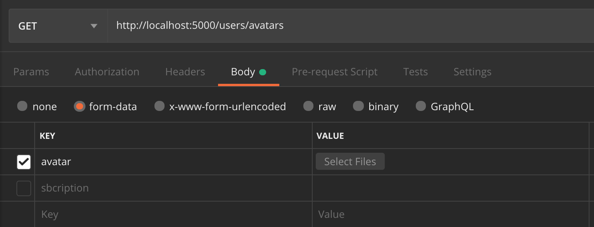

# Tier 4. Module 5 - Fullstack. Back End Development: Node.js

## Homework for Topic 9 - Working with files and testing applications

### Technical task

Create a branch `hw05-avatars` from the `master` branch. Continue creating the REST API for working with the contact collection. Add the ability to load a user's avatar via [Multer](https://github.com/expressjs/multer).

#### Step 1

- Create a folder `public` for static distribution. In this folder, create a folder `avatars`.
- Configure Express to distribute static files from the `public` folder.
- Put any image in the `public/avatars` folder and check that static distribution works.
- When you navigate to this URL, the browser will display the image. Shell `http://localhost:<port>/avatars/<filename with extension>`.

#### Step 2

**Registration**

Add a new `avatarURL` property to the user schema to store the image.

```JS
{
  ...
  avatarURL: DataTypes.STRING,
  ...
}
```

Use the [gravatar](https://www.npmjs.com/package/gravatar) package to immediately generate an avatar for a new user based on their `email` address when they register.

#### Step 3

When registering a user:

- Create a link to the user's avatar using [gravatar](https://www.npmjs.com/package/gravatar).
- Save the resulting URL in the `avatarURL` field when creating the user.

#### Step 4

- Add the ability to update the avatar by creating the `/auth/avatars` endpoint and using the `PATCH` method.



```Python
# Request
PATCH /auth/avatars
Content-Type: multipart/form-data
Authorization: "Bearer {{token}}"
RequestBody: uploaded file

# Success
Status: 200 OK
Content-Type: application/json
ResponseBody: {
"avatarURL": "here will be a link to the image"
}

# Failure
Status: 401 Unauthorized
Content-Type: application/json
ResponseBody: {
"message": "Not authorized"
}
```

- Create a `temp` folder in the root of the project and save the downloaded avatar in it.
- Move the user avatar from the `temp` folder to the `public/avatars` folder and give it a unique name for the specific user.
- The resulting URL `/avatars/<filename with extension>` and save it in the user `avatarURL` field.

#### Additional task (optional)

Write unit tests for the login controller using [Jest](https://jestjs.io/ru/docs/getting-started):

- the response should have a status code of 200
- the response should return a token
- the response should return a `user` object with 2 fields `email` and `subscription` with data type `String`

### Acceptance criteria

- Repository with homework created
- Link to repository sent to mentor for review
- Code meets project specifications
- There are no commented code sections in the code
- Project works correctly with current LTS version of Node
